# Cinema Project

Приложение служит для сбора и хранения структурированной информации о кинематографе

# Запуск

Пререквизиты:

* JDK 11
* Maven
* Установленный и настроенный MySQL Server 

Для того что бы запустить веб прижение необходимо 

#### 1. Выполнить настройку приложения с помощью переменных окружения 

| Переменная  | Описание                                     |  Значение по умолчанию                                                | 
| ----------- | -------------------------------------------- | --------------------------------------------------------------------- |
| DB_URL      | URL для подключения к базе данных            | jdbc:mysql://localhost:3306/cinema_db?useSSL=false&serverTimezone=UTC |
| DB_USERNAME | Логин для подключения к базе данных          | cinema_server                                                         |
| DB_PASSWORD | Пароль для подключения к базе данных         | Cinema123!                                                            |
| UPLOAD_PATH | Путь к папке в которой будут храниться файлы | /cinema-project-files                                                 |

##### Настройка переменных окружения:

В bash:
```bash
  $>DB_URL=???
```
В cmd:
```cmd
  >set DB_URL=???
```

#### 2. Выполнить в bash/cmd следующую команду

```bash
  $>mvn spring-boot:run
```

# Пользовательский интерфейс

## Основной функционал:

### Логин, Регистрация

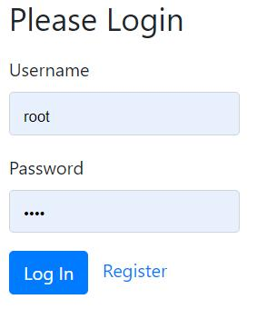 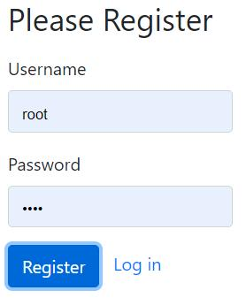

### Главная страница

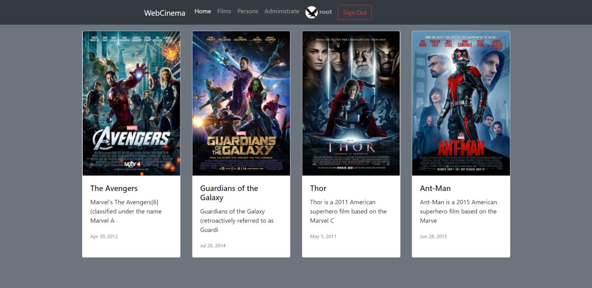

### Страница фильмов

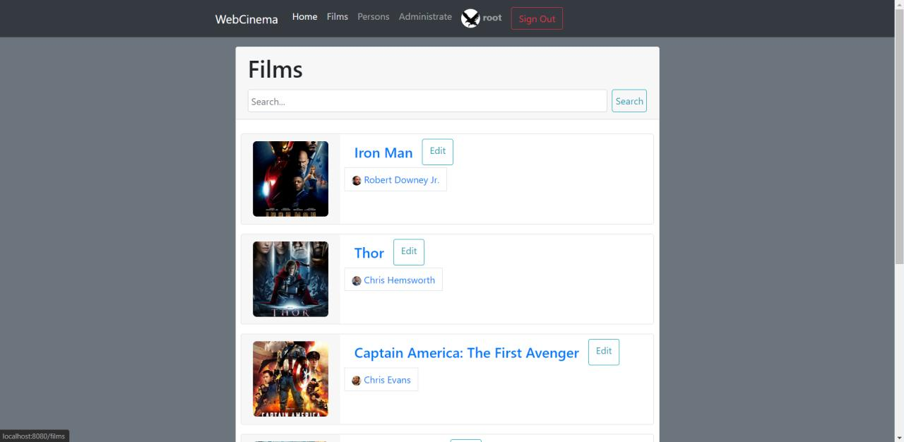
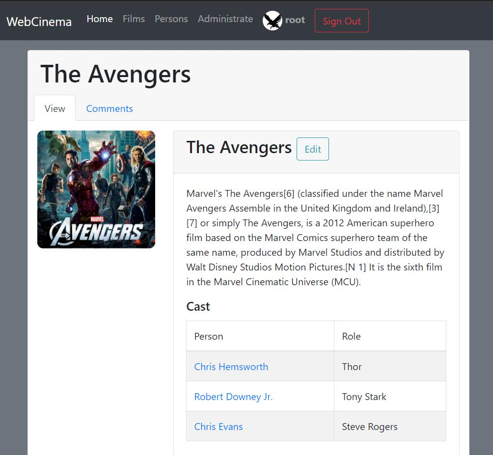

### Страница актёра

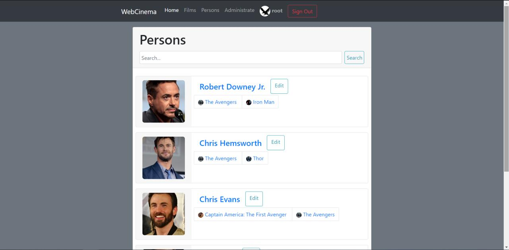
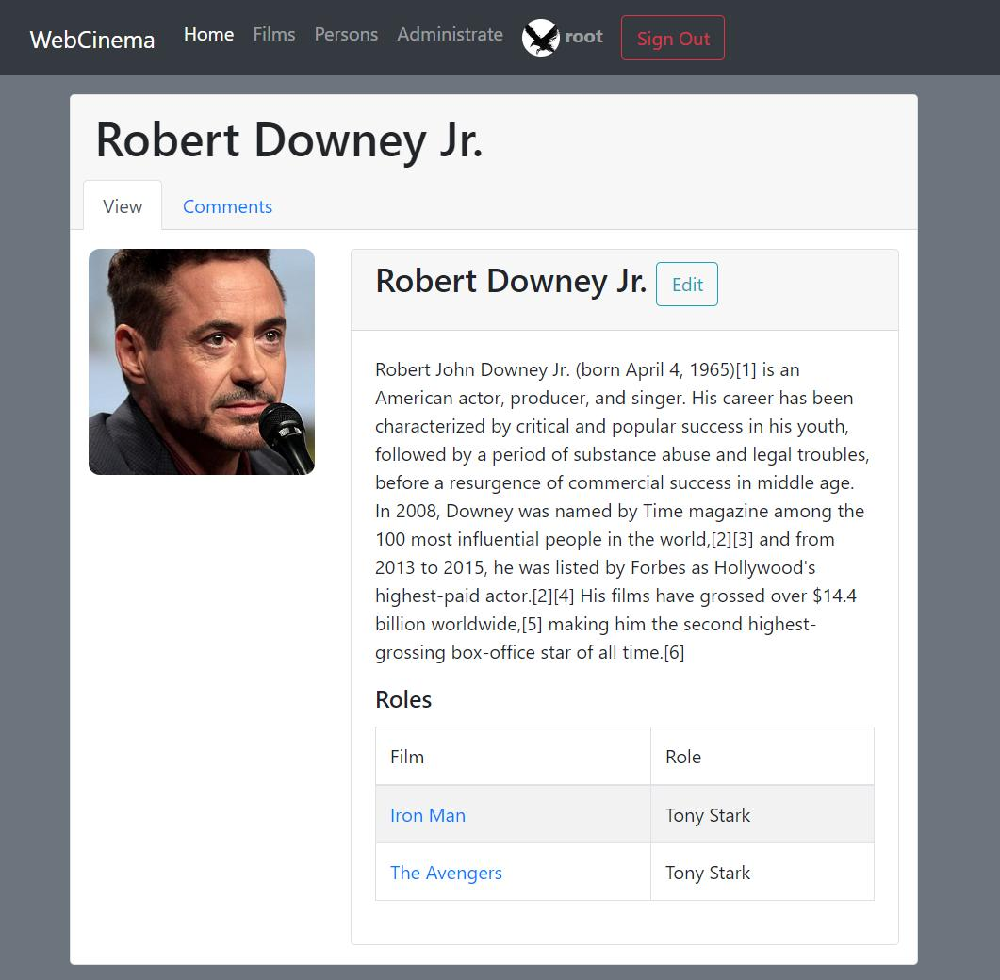

### Комментарии

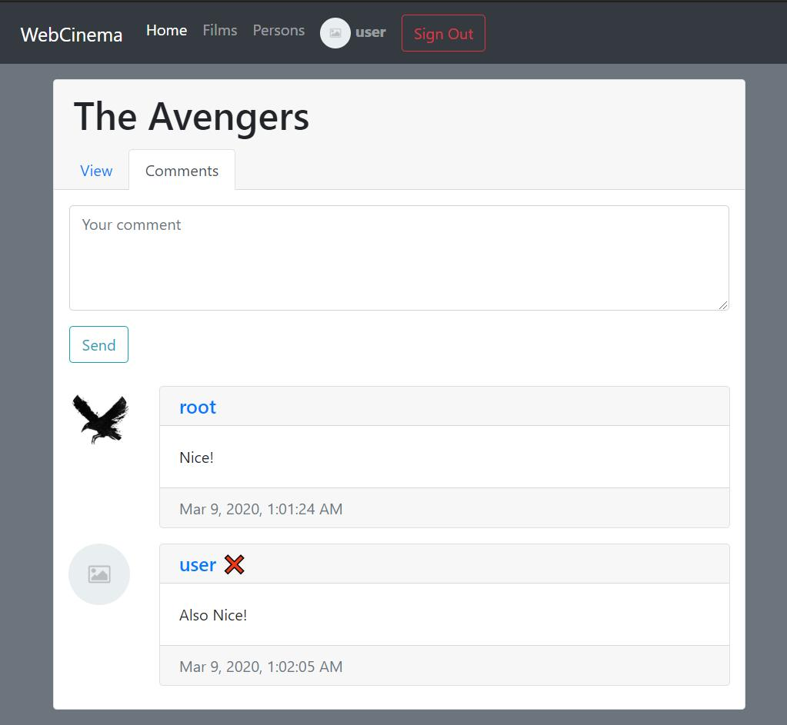

### Редактирование профиля

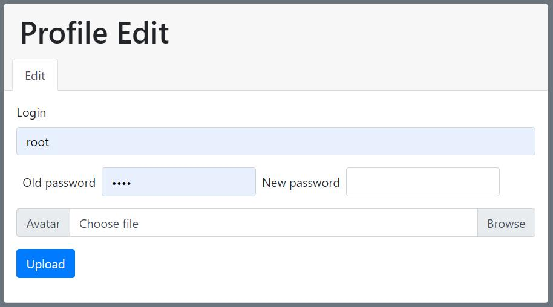

## Функционал администратора

### Добавление/Изменение фильма/актёра

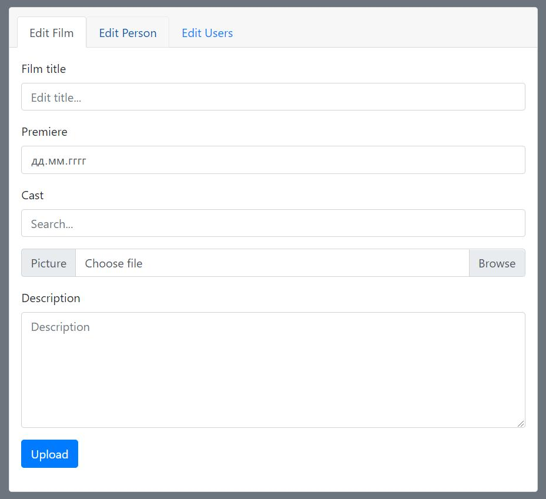 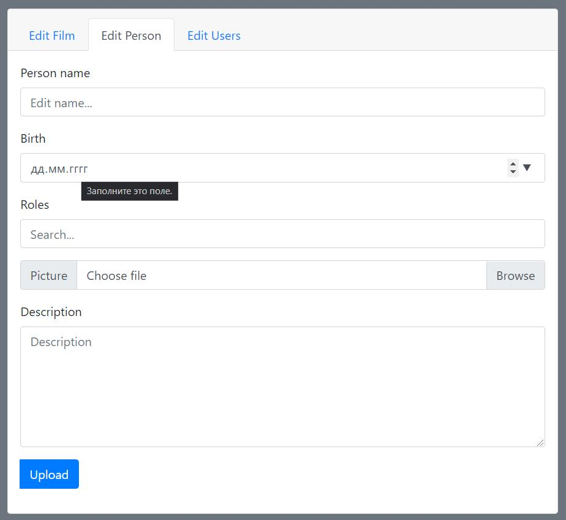

### Изменение привиллегий пользователя

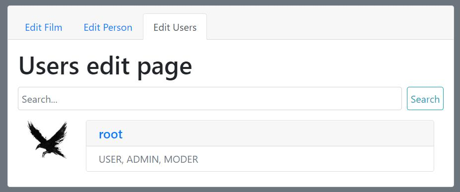 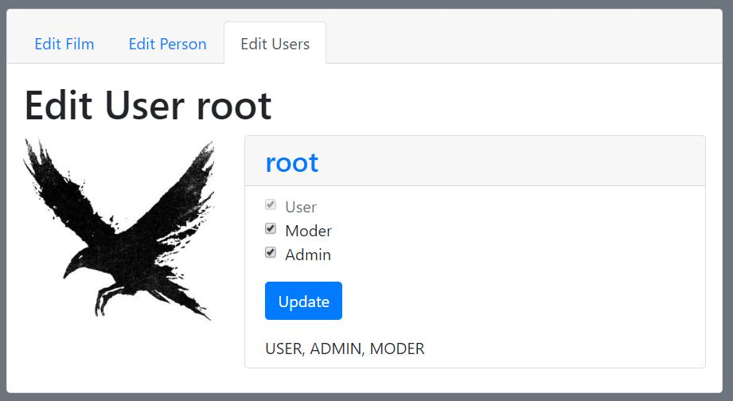

